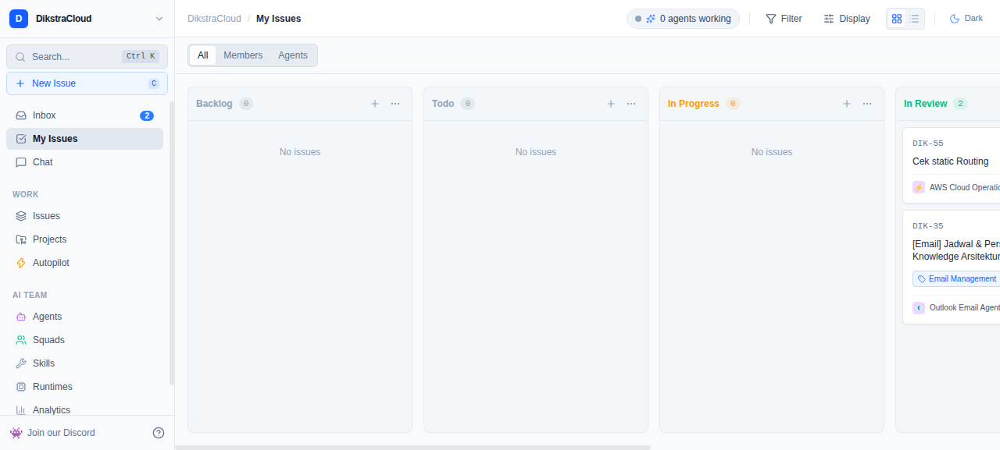
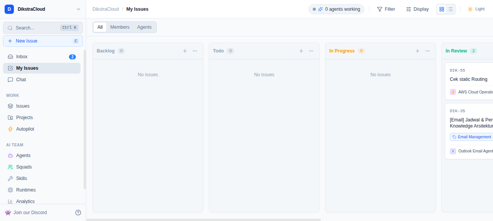
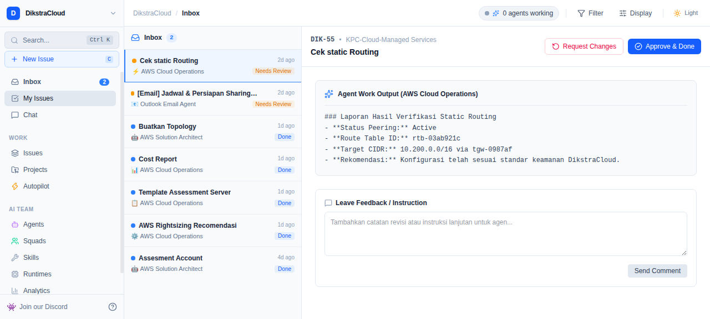
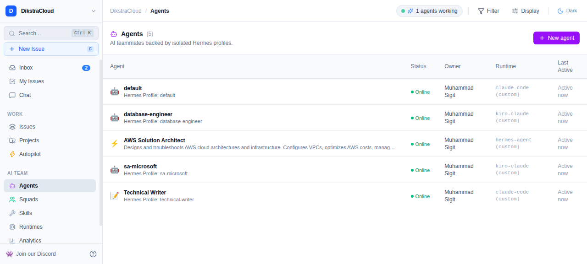
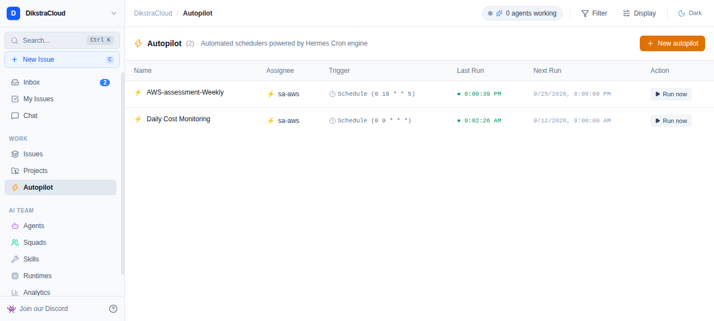
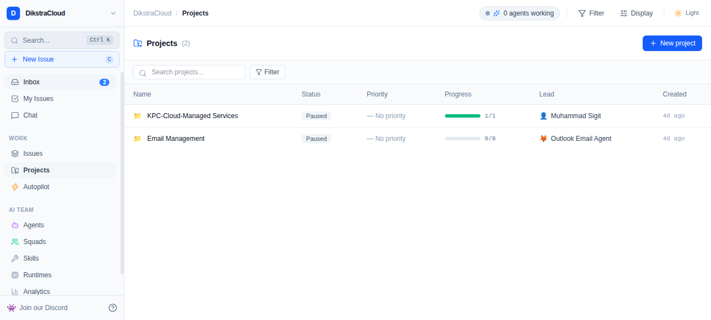

# ⚡ Hermes Agentic Hub

> **Linear / Multica-inspired Command Center** for Human-in-the-Loop AI Agent Orchestration, powered by **Hermes Agent Core Engine**.

[](https://vitejs.dev/)
[](https://react.dev/)
[](https://www.typescriptlang.org/)
[](https://tailwindcss.com/)
[](https://fastapi.tiangolo.com/)
[](https://github.com/NousResearch/hermes-agent)

---

## 📸 Preview & Screenshots

| Kanban Board (Dark Mode) | Light Mode Contrast |
| :---: | :---: |
|  |  |

| Human-in-the-Loop Inbox | Multi-Profile AI Fleet |
| :---: | :---: |
|  |  |

| Autopilot Cron Scheduler | Project Workspaces |
| :---: | :---: |
|  |  |

---

## 🌟 Key Features

* **🎨 Linear / Multica Aesthetic UI:**
  * High-contrast Dark Mode (`#0D0F12`), Clean Light Mode, and System theme toggle.
  * Keyboard-centric shortcuts (`C` for New Issue, `Ctrl+K` / `Cmd+K` for Global Search).
  * Robust `<ErrorBoundary>` integration preventing blank screens on unexpected errors.
* **📋 Interactive Kanban Board:**
  * 6 workflow stages: `Backlog`, `Todo`, `In Progress`, `In Review`, `Blocked`, and `Done`.
  * Native HTML5 Drag-and-Drop column transitions without third-party heavy libraries.
  * Instant **Run Agent** dispatch button directly from issue cards.
* **🔍 Multica Issue Detail Drawer & Live Observability:**
  * Native two-column layout matching Linear / Multica design system with collapsible Properties sidebar.
  * **Dynamic Activity Stream:** Real-time event tracking from Hermes engine (`task_events`) and live comment thread (`task_comments`) with direct posting.
  * **Run Inspector & Host Telemetry:** Live `psutil` metrics (CPU % gauge, RAM RSS in MB, PID, threads, heartbeat).
  * **Emergency Stop / Terminate Worker:** Direct worker process termination via SIGTERM/SIGKILL (`/runs/{id}/terminate`).
  * **Execution Log & Timeline Trace Drawer:** Chronological tool step trace (`Bash / PowerShell`, `kanban_*`, `skill_*`), model vs tools timeline breakdown, search filter, and agent final report.
* **📎 Deliverables & Work Artifacts Management:**
  * Categorized file cards for Terraform (`.tf`), CloudFormation/Config (`.yaml`, `.json`), Documentation (`.md`), and Architecture Diagrams (`.svg`, `.png`).
  * Built-in in-app code and spec previewer with line numbers, copy button, and direct download.
* **📥 Human-in-the-Loop (HITL) Inbox Review Center:**
  * Dual-tab review workspace: **Executive Summary** vs **Deliverables & Files**.
  * Pre-approval code/artifact inspection before issuing **Approve & Done** or **Request Changes**.
* **🤖 Autonomous AI Team Fleet:**
  * Multi-profile management: `sa-aws` (AWS Solutions Architect), `sa-microsoft` (Azure Specialist), `technical-writer`, `database-engineer`, and `default`.
  * Dynamic assignee and project mapping reflecting live server configuration.
* **⚡ Autopilot (Hermes Cron Engine):**
  * Schedule, monitor, trigger immediately (*Run now*), or toggle (*Pause / Resume*) automated recurring tasks.
* **🌐 Enterprise Networking & Universal Paths:**
  * Seamless Vite `/api` reverse proxying to FastAPI backend bridge on port `9120`.
  * Realtime event streaming via Hermes WebSocket `/events`.
  * Universal path resolution supporting `~/.hermes/...` across any Linux/WSL user environment.

---

## 🏗️ Architecture

```
┌─────────────────────────────────────────────────────────────────────────┐
│                 TIER 1: FRONTEND WEB APPLICATION                        │
│               (Vite 6 + React 19 + TypeScript + Tailwind v4)            │
│  • Dark/Light Multi-Theme    • Kanban Board View    • Split Inbox View   │
│  • Projects Overview         • Autopilot UI         • AI Team Fleet      │
└────────────────────────────────────┬────────────────────────────────────┘
                                     │ HTTPS / HTTP Proxy (/api/*)
┌────────────────────────────────────▼────────────────────────────────────┐
│                 TIER 2: HERMES HARNESS BRIDGE API                       │
│                        (FastAPI - Port 9120)                            │
│  File: server.py                                                        │
│  • Router Kanban: /api/plugins/kanban/ (Tasks, Boards, Events, Workers) │
│  • Router Cron:   /api/cron/jobs       (Autopilot Schedules)            │
│  • Router Profiles: /api/profiles      (Hermes Fleet Profiles)          │
│  • Router Skills:   /api/skills        (Installed Capabilities Catalog) │
│  • WebSocket Token: /api/ws-token      (Session Token for /events)      │
└────────────────────────────────────┬────────────────────────────────────┘
                                     │ Native Python Binding & IPC
┌────────────────────────────────────▼────────────────────────────────────┐
│                 TIER 3: HERMES AGENT CORE ENGINE                        │
│  • SQLite Storage: ~/.hermes/kanban.db & state.db                       │
│  • Multi-Profile Fleet: ~/.hermes/profiles/<profile>/config.yaml        │
│    - sa-aws, sa-microsoft, technical-writer, database-engineer, default │
│  • Background Dispatcher: hermes kanban dispatch / gateway loop         │
└─────────────────────────────────────────────────────────────────────────┘
```

---

## 📂 Repository Structure

```
hermes-agentic-hub/
├── doc/                        # Technical documentation & PRD
│   ├── DOCUMENTATION.md        # Full architecture & implementation details
│   └── PRD.md                  # Product Requirements Document
├── picture/                    # Screenshots and UI previews
│   ├── live_board.png
│   ├── dark_mode.png
│   ├── light_mode.png
│   ├── inbox_view.png
│   ├── live_agents.png
│   ├── live_autopilot.png
│   └── projects_view.png
├── src/
│   ├── api/                    # hermesApi live client (Kanban, Profiles, Cron, WS)
│   ├── components/             # React UI components & modals
│   ├── context/                # Multi-theme provider context
│   ├── data/                   # Fallback mock data
│   ├── types.ts                # TypeScript interfaces
│   ├── App.tsx                 # Main application router & state controller
│   └── main.tsx                # React root entry
├── server.py                   # FastAPI backend bridge service (Port 9120)
├── vite.config.ts              # Vite 6 config with /api proxy & allowed hosts
├── package.json
└── README.md
```

---

## 🚀 Quick Start

### 1. Prerequisites
* **Node.js:** v18+ (tested with Node 20+)
* **Python:** 3.10+ (with FastAPI & Uvicorn installed in Hermes venv)
* **Hermes Agent:** Installed at `~/.hermes/hermes-agent`

### 2. Run Backend Bridge
```bash
# Activate Hermes Python environment and run bridge
~/.hermes/hermes-agent/venv/bin/python server.py
# Backend runs at http://127.0.0.1:9120
```

### 3. Run Frontend Development Server
```bash
# Install dependencies
npm install

# Start development server
npm run dev
# Accessible at http://localhost:5173
```

### 4. Build for Production
```bash
# Compile TypeScript and bundle Vite assets
npm run build

# Preview production build
npm run preview -- --port 5173 --host 0.0.0.0
```

---

## 📖 Additional Documentation

For comprehensive information regarding business requirements, API endpoints, and configuration:
* [Implementation & Architecture Documentation](doc/DOCUMENTATION.md)
* [Product Requirements Document (PRD)](doc/PRD.md)

---

## 📄 License

Internal project for DikstraCloud Workspace. All rights reserved.
