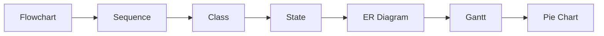
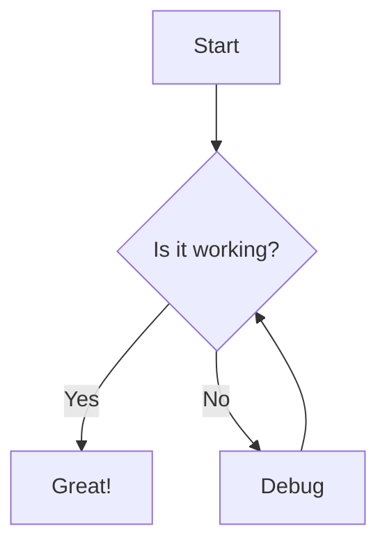
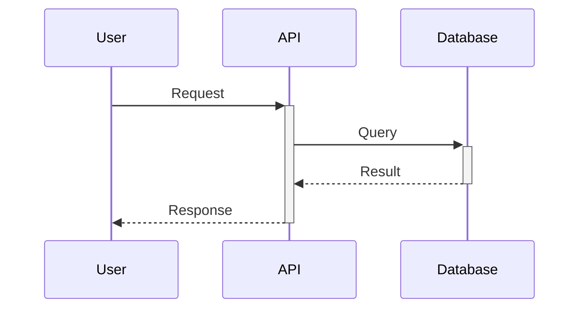
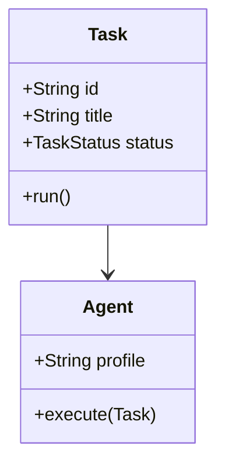

# Rich Content Rendering

## Overview
Advanced content rendering system supporting Markdown, Mermaid diagrams, syntax-highlighted code blocks, tables, and embedded media within task descriptions, comments, and chat messages.

## Key Features

### 1. **Markdown Rendering**

#### Supported Syntax
```typescript
interface MarkdownFeatures {
  headers: 'H1-H6'
  emphasis: ['bold', 'italic', 'strikethrough']
  lists: ['ordered', 'unordered', 'nested']
  links: ['inline', 'reference']
  images: ['inline', 'with-alt']
  blockquotes: true
  codeBlocks: true
  inlineCode: true
  tables: true
  horizontalRules: true
}
```

#### Rendering Engine
```typescript
import { marked } from 'marked'
import DOMPurify from 'dompurify'

// Configure marked renderer
marked.setOptions({
  breaks: true,        // GFM line breaks
  gfm: true,          // GitHub Flavored Markdown
  headerIds: true,    // Generate header IDs
  mangle: false,      // Keep email addresses as-is
})

// Sanitize output to prevent XSS
const renderMarkdown = (content: string): string => {
  const html = marked.parse(content)
  return DOMPurify.sanitize(html, {
    ALLOWED_TAGS: ['p', 'br', 'strong', 'em', 'code', 'pre', 'a', 'ul', 'ol', 'li', 'h1', 'h2', 'h3', 'h4', 'h5', 'h6', 'blockquote', 'table', 'thead', 'tbody', 'tr', 'th', 'td', 'img', 'del'],
    ALLOWED_ATTR: ['href', 'src', 'alt', 'title', 'class']
  })
}
```

#### Component: `MarkdownRenderer.tsx`
```typescript
interface MarkdownRendererProps {
  content: string
  className?: string
  enableMermaid?: boolean
}

export const MarkdownRenderer: React.FC<MarkdownRendererProps> = ({
  content,
  className,
  enableMermaid = true
}) => {
  const htmlContent = useMemo(() => renderMarkdown(content), [content])
  const containerRef = useRef<HTMLDivElement>(null)
  
  // Render Mermaid diagrams after markdown rendering
  useEffect(() => {
    if (!enableMermaid || !containerRef.current) return
    
    const mermaidBlocks = containerRef.current.querySelectorAll('.language-mermaid')
    mermaidBlocks.forEach(async (block) => {
      const code = block.textContent || ''
      const diagram = await renderMermaid(code)
      block.replaceWith(diagram)
    })
  }, [htmlContent, enableMermaid])
  
  return (
    <div
      ref={containerRef}
      className={clsx('markdown-content', className)}
      dangerouslySetInnerHTML={{ __html: htmlContent }}
    />
  )
}
```

### 2. **Code Block Rendering**

#### Syntax Highlighting
```typescript
import Prism from 'prismjs'
import 'prismjs/components/prism-typescript'
import 'prismjs/components/prism-python'
import 'prismjs/components/prism-bash'
import 'prismjs/components/prism-yaml'
import 'prismjs/components/prism-json'
// ... 200+ languages available

interface CodeBlockProps {
  code: string
  language: string
  showLineNumbers?: boolean
  highlightLines?: number[]
  filename?: string
}

export const CodeBlock: React.FC<CodeBlockProps> = ({
  code,
  language,
  showLineNumbers = true,
  highlightLines = [],
  filename
}) => {
  const [copied, setCopied] = useState(false)
  
  const highlightedCode = useMemo(() => {
    const grammar = Prism.languages[language]
    if (!grammar) return code
    
    return Prism.highlight(code, grammar, language)
  }, [code, language])
  
  const handleCopy = async () => {
    await navigator.clipboard.writeText(code)
    setCopied(true)
    setTimeout(() => setCopied(false), 2000)
  }
  
  return (
    <div className="code-block">
      {filename && (
        <div className="code-header">
          <span className="filename">{filename}</span>
          <button onClick={handleCopy} className="copy-button">
            {copied ? <Check size={16} /> : <Copy size={16} />}
          </button>
        </div>
      )}
      <pre className={`language-${language}`}>
        <code dangerouslySetInnerHTML={{ __html: highlightedCode }} />
      </pre>
    </div>
  )
}
```

#### Supported Languages
- **Web**: JavaScript, TypeScript, HTML, CSS, SCSS
- **Backend**: Python, Java, Go, Rust, C, C++, C#
- **DevOps**: Bash, PowerShell, Dockerfile, YAML, JSON
- **Cloud**: Terraform, CloudFormation, Kubernetes
- **Database**: SQL, PostgreSQL, MongoDB
- **Other**: Markdown, LaTeX, GraphQL, TOML

### 3. **Mermaid Diagram Rendering**

#### Component: `MermaidViewer.tsx`
```typescript
import mermaid from 'mermaid'

// Configure Mermaid
mermaid.initialize({
  startOnLoad: false,
  theme: 'dark',
  themeVariables: {
    primaryColor: '#F97316',
    primaryTextColor: '#F3F4F6',
    primaryBorderColor: '#FB923C',
    lineColor: '#6B7280',
    secondaryColor: '#191C21',
    tertiaryColor: '#2A2524',
    background: '#0F1115',
    mainBkg: '#191C21',
    textColor: '#F3F4F6',
    fontSize: '14px',
    fontFamily: 'Inter, sans-serif'
  },
  flowchart: {
    useMaxWidth: true,
    htmlLabels: true,
    curve: 'basis'
  }
})

interface MermaidViewerProps {
  chart: string
  onError?: (error: Error) => void
}

export const MermaidViewer: React.FC<MermaidViewerProps> = ({
  chart,
  onError
}) => {
  const [svg, setSvg] = useState<string>('')
  const [error, setError] = useState<string | null>(null)
  const containerRef = useRef<HTMLDivElement>(null)
  
  useEffect(() => {
    const renderDiagram = async () => {
      try {
        const id = `mermaid-${Math.random().toString(36).slice(2)}`
        const { svg } = await mermaid.render(id, chart)
        setSvg(svg)
        setError(null)
      } catch (err) {
        const errorMsg = err instanceof Error ? err.message : 'Failed to render diagram'
        setError(errorMsg)
        onError?.(err as Error)
      }
    }
    
    renderDiagram()
  }, [chart, onError])
  
  if (error) {
    return (
      <div className="mermaid-error">
        <AlertTriangle size={20} />
        <p>Failed to render diagram: {error}</p>
      </div>
    )
  }
  
  return (
    <div
      ref={containerRef}
      className="mermaid-viewer"
      dangerouslySetInnerHTML={{ __html: svg }}
    />
  )
}
```

#### Supported Diagram Types


Examples:

**Flowchart**


**Sequence Diagram**


**Class Diagram**


### 4. **Table Rendering**

#### GitHub Flavored Markdown Tables
```markdown
| Feature | Status | Priority |
|---------|--------|----------|
| Kanban | ✅ Done | High |
| Chat | 🚧 In Progress | High |
| Analytics | 📋 Planned | Medium |
```

Rendered as:

| Feature | Status | Priority |
|---------|--------|----------|
| Kanban | ✅ Done | High |
| Chat | 🚧 In Progress | High |
| Analytics | 📋 Planned | Medium |

#### Styling
```css
.markdown-content table {
  width: 100%;
  border-collapse: collapse;
  margin: 16px 0;
  font-size: 13px;
}

.markdown-content th {
  background: #191C21;
  border: 1px solid #2A2524;
  padding: 8px 12px;
  text-align: left;
  font-weight: 600;
  color: #9CA3AF;
}

.markdown-content td {
  border: 1px solid #2A2524;
  padding: 8px 12px;
  color: #F3F4F6;
}

.markdown-content tr:hover {
  background: rgba(249, 115, 22, 0.05);
}
```

### 5. **Image & Media Rendering**

#### Inline Images
```markdown


```

#### Image Preview Modal
```typescript
const [previewImage, setPreviewImage] = useState<string | null>(null)

// Click to zoom
 setPreviewImage(imageUrl)}
  className="cursor-zoom-in"
/>

{previewImage && (
  <ImageDiagramPreviewModal
    isOpen={true}
    onClose={() => setPreviewImage(null)}
    imageUrl={previewImage}
    title={altText}
  />
)}
```

Features:
- Click to open full-size preview
- Zoom in/out controls
- Pan and drag
- Download button
- SVG native rendering

### 6. **Link Handling**

#### Auto-linking
```typescript
// Detect and linkify URLs
const linkify = (text: string): string => {
  const urlRegex = /(https?:\/\/[^\s]+)/g
  return text.replace(urlRegex, '<a href="$1" target="_blank" rel="noopener">$1</a>')
}
```

#### Task ID References
```typescript
// Convert #123abc to clickable task links
const linkifyTaskIds = (text: string): string => {
  const taskRegex = /#([a-z0-9]{7})/g
  return text.replace(taskRegex, '<a href="/task/$1" class="task-link">#$1</a>')
}
```

Example:
```markdown
See task #663b67e for details
```

Renders as: See task <a href="/task/663b67e">#663b67e</a>

### 7. **Security & Sanitization**

#### XSS Prevention
```typescript
import DOMPurify from 'dompurify'

// Strict sanitization
const sanitize = (html: string): string => {
  return DOMPurify.sanitize(html, {
    ALLOWED_TAGS: [
      'p', 'br', 'strong', 'em', 'code', 'pre', 'a', 'ul', 'ol', 'li',
      'h1', 'h2', 'h3', 'h4', 'h5', 'h6', 'blockquote', 'table',
      'thead', 'tbody', 'tr', 'th', 'td', 'img', 'del', 'span'
    ],
    ALLOWED_ATTR: ['href', 'src', 'alt', 'title', 'class', 'target', 'rel'],
    FORBID_TAGS: ['script', 'iframe', 'object', 'embed', 'form'],
    FORBID_ATTR: ['onerror', 'onload', 'onclick']
  })
}
```

Protection against:
- `<script>` injection
- Event handler attributes
- Malicious iframes
- Data exfiltration attempts

### 8. **Performance Optimizations**

#### Lazy Rendering
```typescript
// Only render visible content
const LazyMarkdown: React.FC<{ content: string }> = ({ content }) => {
  const [isVisible, setIsVisible] = useState(false)
  const ref = useRef<HTMLDivElement>(null)
  
  useEffect(() => {
    const observer = new IntersectionObserver(([entry]) => {
      setIsVisible(entry.isIntersecting)
    })
    
    if (ref.current) observer.observe(ref.current)
    return () => observer.disconnect()
  }, [])
  
  return (
    <div ref={ref}>
      {isVisible ? <MarkdownRenderer content={content} /> : <div className="skeleton" />}
    </div>
  )
}
```

#### Memoization
```typescript
// Cache rendered output
const renderedHtml = useMemo(() => {
  return marked.parse(content)
}, [content])

// Cache Prism highlighting
const highlightedCode = useMemo(() => {
  return Prism.highlight(code, grammar, language)
}, [code, language])
```

#### Code Splitting
```typescript
// Lazy load Mermaid only when needed
const MermaidViewer = lazy(() => import('./MermaidViewer'))

{hasMermaidContent && (
  <Suspense fallback={<div>Loading diagram...</div>}>
    <MermaidViewer chart={mermaidCode} />
  </Suspense>
)}
```

### 9. **Styling & Typography**

#### Markdown Content CSS
```css
.markdown-content {
  font-family: 'Geist', 'Inter', sans-serif;
  font-size: 14px;
  line-height: 1.6;
  color: var(--color-text-primary);
}

.markdown-content h1 {
  font-family: 'Inter', sans-serif;
  font-size: 24px;
  font-weight: 700;
  margin: 24px 0 16px;
  color: var(--color-text-primary);
}

.markdown-content h2 {
  font-size: 20px;
  font-weight: 600;
  margin: 20px 0 12px;
  border-bottom: 1px solid var(--color-border);
  padding-bottom: 8px;
}

.markdown-content code {
  font-family: 'JetBrains Mono', monospace;
  font-size: 13px;
  background: rgba(249, 115, 22, 0.1);
  padding: 2px 6px;
  border-radius: 4px;
}

.markdown-content pre {
  background: #000000;
  border: 1px solid var(--color-border);
  border-radius: 8px;
  padding: 16px;
  overflow-x: auto;
}

.markdown-content blockquote {
  border-left: 4px solid var(--color-primary);
  padding-left: 16px;
  margin: 16px 0;
  color: var(--color-text-secondary);
}

.markdown-content a {
  color: var(--color-primary);
  text-decoration: none;
}

.markdown-content a:hover {
  text-decoration: underline;
}
```

### 10. **Accessibility**

#### Semantic HTML
- Use proper heading hierarchy (H1-H6)
- Alt text required for images
- ARIA labels on interactive elements
- Keyboard navigation support

#### Screen Reader Support
```typescript
<div
  className="markdown-content"
  role="article"
  aria-label="Task description"
>
  <MarkdownRenderer content={description} />
</div>
```

#### Focus Management
```typescript
// Code block copy button
<button
  onClick={handleCopy}
  aria-label="Copy code to clipboard"
  className="copy-button"
>
  {copied ? '✓ Copied' : 'Copy'}
</button>
```

## Technical Implementation

### Dependencies
```json
{
  "dependencies": {
    "marked": "^18.0.13",
    "mermaid": "^12.0.0",
    "prismjs": "^1.30.0",
    "dompurify": "^3.0.0"
  },
  "devDependencies": {
    "@types/marked": "^5.0.0",
    "@types/prismjs": "^1.26.6",
    "@types/dompurify": "^3.0.0"
  }
}
```

### Integration Example
```typescript
// In TaskDetailModal or ChatView
<MarkdownRenderer
  content={task.description}
  enableMermaid={true}
  className="task-description"
/>
```

## User Interactions

### Writing Markdown
1. Use standard Markdown syntax in any text field
2. Preview renders automatically
3. Mermaid diagrams detected by code fence language

### Viewing Code
1. Syntax highlighting applies automatically
2. Click "Copy" button to copy code
3. Scroll horizontally for long lines

### Mermaid Diagrams
1. Write diagram in code fence with language `mermaid`
2. Diagram renders automatically
3. Click to zoom/pan (future enhancement)

## Future Enhancements
- LaTeX math rendering (KaTeX)
- Collaborative editing with conflict resolution
- Diff view for markdown changes
- Export to PDF with styling
- Custom emoji support
- @mentions autocomplete
- Task checklists (interactive)
- Embedded videos (YouTube, Loom)
- Code execution (sandboxed)
- Diagram editing (inline editor)
