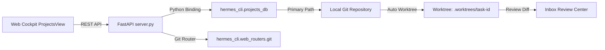

# Product Requirements Document (PRD) — Release v0.1.3
# First-Class Native Projects & Git Worktrees Execution

* **Versi Rilis:** `v0.1.3`
* **Status:** Draft / Planned
* **Prasyarat:** `v0.1.2`
* **Kategori:** Project Architecture, Git Worktrees & Human-in-the-Loop Review

---

## 1. Executive Summary & Tujuan

Saat ini, modul Projects di antarmuka web hanya menampilkan daftar *board* dari tabel kanban (`GET /boards`). Konsep "Project" disamakan dengan "Kanban Board Slug", sehingga task AI dieksekusi di direktori sementara (*scratch workspace*) tanpa ikatan ke repositori Git fisik di disk.

Rilis **v0.1.3** mengintegrasikan entitas native **`projects.db`** milik Hermes Agent. Setiap Project kini mengikat repositori Git fisik (`primary_path`), memiliki instruksi pedoman arsitektur (`AGENTS.md`), dan terikat ke Kanban Board (`board_slug`). Ketika sebuah task dijalankan di dalam Project, Hermes secara otomatis membuat **Git Worktree** terisolasi di `<repo>/.worktrees/<task-id>` dengan branch deterministik (`feat-<task-id>`). Hasil pekerjaan agen dapat di-review secara visual berupa **Git Diff** langsung di Inbox sebelum di-approve.

---

## 2. Ruang Lingkup Fitur (Feature Scope)

### 2.1. First-Class Native Projects (`projects.db`)
1. **Projects Store Integration:** Sinkronisasi langsung ke SQLite `~/.hermes/projects.db`.
2. **Local Repo Discovery:** Menampilkan repositori Git yang terdeteksi di mesin host (`discovered_repos`), memudahkan operator memilih repositori proyek.
3. **Project Shared Context:** Injeksi instruksi teknis proyek (`AGENTS.md` / rules) ke setiap agen yang bekerja pada board tersebut.

### 2.2. Automated Git Worktree Task Execution
1. **Project Task Binding:** Form pembuatan tiket baru (`NewIssueModal`) memungkinkan pengikatan ke `project_id`.
2. **Deterministic Branch & Worktree:** Dispatcher Hermes otomatis mengeksekusi worker di dalam Git Worktree terpisah:
   - Path: `<primary_path>/.worktrees/<task_id>`
   - Branch: `<project-slug>-<task-id>` (misal `kpc-prod-t_663b67e`)
3. **Isolasi Penuh:** Branch utama (`main`/`master`) tidak akan terganggu atau mengalami konflik git saat beberapa agen bekerja secara paralel.

### 2.3. Git Review Center di Tab Inbox
1. **Visual Git Diff Viewer:** Membaca perubahan kode (`GET /api/git/review/diff`) dari worktree task yang berstatus `review`.
2. **Interactive Stage / Unstage / Revert:** Memilih file yang ingin diikutsertakan dalam commit persetujuan.
3. **Direct Commit & PR:** Tombol untuk melakukan merge commit atau membuat GitHub Pull Request langsung dari Inbox.

---

## 3. Arsitektur & Kontrak API Backend

| Modul | Method & Endpoint | Keterangan |
|---|---|---|
| **Projects** | `GET /api/projects` | List project dari `projects.db` |
| **Projects** | `POST /api/projects` | Buat project baru (nama, path, board) |
| **Projects** | `PATCH /api/projects/{id}` | Update metadata & context project |
| **Projects** | `GET /api/projects/discovered-repos` | Daftar repositori git terdeteksi |
| **Git** | `GET /api/git/status` | Cek status git di worktree/repo |
| **Git** | `GET /api/git/worktrees` | List worktrees aktif |
| **Git** | `GET /api/git/review/diff` | Ambil unified git diff pekerjaan agen |
| **Git** | `POST /api/git/review/commit` | Commit perubahan dari hasil review |
| **Git** | `POST /api/git/review/create-pr` | Buat GitHub PR langsung dari task |

---

## 4. Kriteria Keberhasilan (Acceptance Criteria)

- [ ] Project yang dibuat di web UI terdaftar di `~/.hermes/projects.db` dan muncul di CLI `hermes project list`.
- [ ] Task yang dijalankan di dalam Project otomatis membuat git worktree mandiri di folder repo terkait.
- [ ] Tab Inbox pada tiket yang selesai menampilkan visual Git Diff dengan syntax highlighting.
- [ ] Operator dapat meng-approve pekerjaan agen dan melakukan commit/PR langsung dari dashboard.
