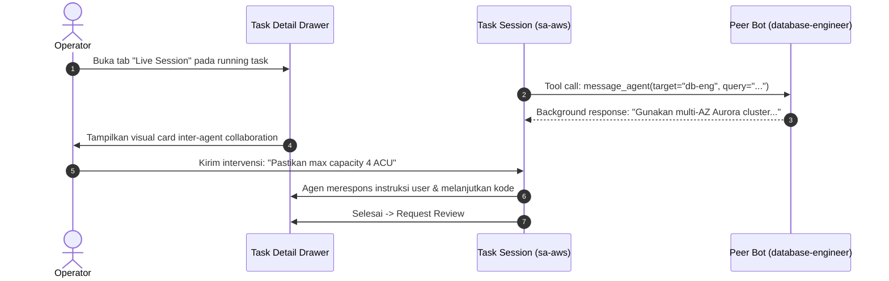

# Product Requirements Document (PRD) — Release v0.1.4
# Bot Mode, Agent Direct Messaging & Live Task Sessions

* **Versi Rilis:** `v0.1.4`
* **Status:** Draft / Planned
* **Prasyarat:** `v0.1.3`
* **Kategori:** Conversational Multi-Agent, Inter-Agent Messaging & Interactive Execution

---

## 1. Executive Summary & Tujuan

Hermes Agent memiliki fitur native **Bot Mode** di mana setiap profil agen bertransformasi menjadi **Bot** spesialis dengan *Canonical Bot Chat* permanen, kesadaran daftar rekan tim (*roster awareness*), dan tool native **`message_agent`** untuk saling bertukar pesan langsung (*Bot-to-Bot direct messaging*).

Rilis **v0.1.4** membawa kekuatan Bot Mode ini ke dalam Hermes Agentic Hub:
1. Menghadirkan **Canonical Bot Chat** permanen per agen di tab Chat.
2. Mengaktifkan komunikasi **Bot-to-Bot** berbasis tool `message_agent` dan autocomplete `@mention`.
3. Membangun **Task-to-Session Interactive Bridge** di dalam drawer detail tugas, memungkinkan operator mengirim pesan dan mengintervensi agen yang sedang berjalan (*running task*) secara real-time.

---

## 2. Ruang Lingkup Fitur (Feature Scope)

### 2.1. Canonical Bot Chat & Roster Management
1. **Persistent Forever-Chat:** Setiap profil bot memiliki satu sesi obrolan permanen bertajuk `"Bot Chat"` yang tidak pernah hilang atau terpecah menjadi scratch session baru.
2. **Bot Mode Metadata Marker:** Memastikan profil membawa blok `ui_meta: { hermes-bots: {} }` di `profile.yaml` sehingga Hermes menginjeksi protokol komunikasi agen dan tool `message_agent`.
3. **Roster Autocomplete (`@mention`):** Saat pengguna mengetik karakter `@` di composer obrolan, muncul popup autocomplete yang menampilkan daftar bot spesialis beserta keahlian mereka.

### 2.2. Inter-Agent Direct Messaging (`message_agent`)
1. **Direct Message Tool Call:** Bot dapat berkonsultasi ke bot lain di tengah giliran kerja dengan memanggil `message_agent(target, message)`.
2. **Visual Inter-Agent Activity Card:** Menampilkan bubble interaksi khusus ketika Bot A memanggil Bot B di timeline:
   `[🤖 sa-aws memanggil 📝 technical-writer: "Tolong periksa format dokumentasi modul ini"]`
3. **Intentional Silence Tokens:** Menangani token diam (`[SILENT]`, `NO_REPLY`) agar percakapan antar agen tidak mengalami perulangan (*infinite loop*).

### 2.3. Task-to-Session Interactive Bridge
1. **Live Interactive Terminal di Task Drawer:**
   - Di samping tab "Execution Log" (stdout pasif), sediakan tab **"Live Session"**.
   - Terhubung langsung ke sesi eksekusi task via WebSocket / SSE.
2. **Mid-Execution Human Intervention:**
   - Operator dapat mengirim instruksi koreksi langsung saat agen berstatus `running` ("Jangan pakai KMS default, gunakan customer-managed key arn:...").
   - Agen menerima instruksi sebagai pesan user baru dan langsung menyesuaikan langkah kerjanya tanpa harus di-kill / terminate.

---

## 3. Arsitektur Komunikasi Bot-to-Bot & Session Bridge

---

## 4. Kriteria Keberhasilan (Acceptance Criteria)

- [ ] Setiap agen di tab Chat memiliki satu Canonical Bot Chat permanen yang otomatis ter-load saat profil dipilih.
- [ ] Mengetik `@` di input chat memunculkan autocomplete nama bot dan perannya.
- [ ] Tool `message_agent` aktif di prompt agen dan bot dapat memanggil bot lain tanpa error.
- [ ] Tab Live Session di Task Detail Modal memungkinkan pengiriman pesan langsung ke task yang sedang running.
